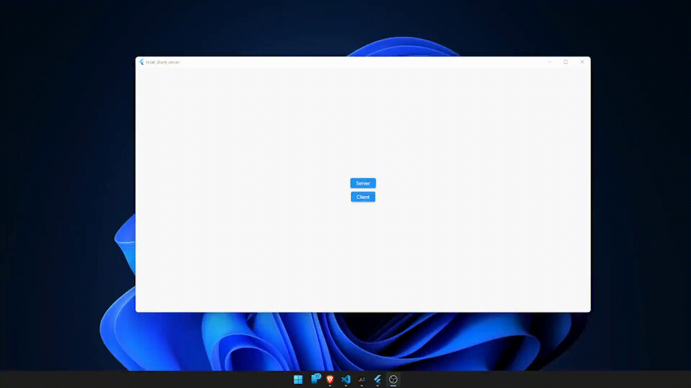

# Total Share

File sharing via TCP sockets.

The project uses the LAN connection to share files through TCP sockets, so we are not limited by the speed of our Internet.

> Server and Client must be on the same LAN.

Tested in:

- [x] Windows 10
- [x] Linux
- [x] Andorid
- [ ] iOS
- [ ] MacOS

# Test

## Windows -> Windows 

## Android -> Windows 

| Android                                    | Windows                                    |
| ------------------------------------------ | ------------------------------------------ |
|                                            |                                            |
|  |  |